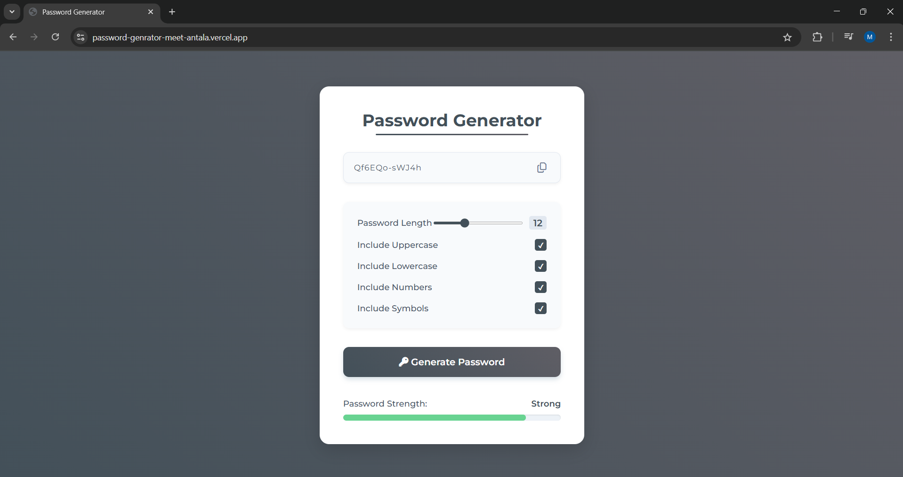

# 🔐 Password Generator

A secure and responsive **Password Generator** built using **HTML**, **CSS**, and **JavaScript**. This app allows users to generate customizable, strong passwords and check their strength visually.

## 🖼️ Demo

Try the live version here: [https://password-genrator-meet-antala.vercel.app/](https://password-genrator-meet-antala.vercel.app/)

## 🚀 Features

- ✅ Real-time password generation
- ✅ Select password length (6 to 24 characters)
- ✅ Options to include:
  - Uppercase letters
  - Lowercase letters
  - Numbers
  - Symbols
- ✅ Password strength indicator (Weak, Medium, Strong)
- ✅ One-click copy to clipboard
- ✅ Beautiful UI with responsive design

## 📸 Screenshots

